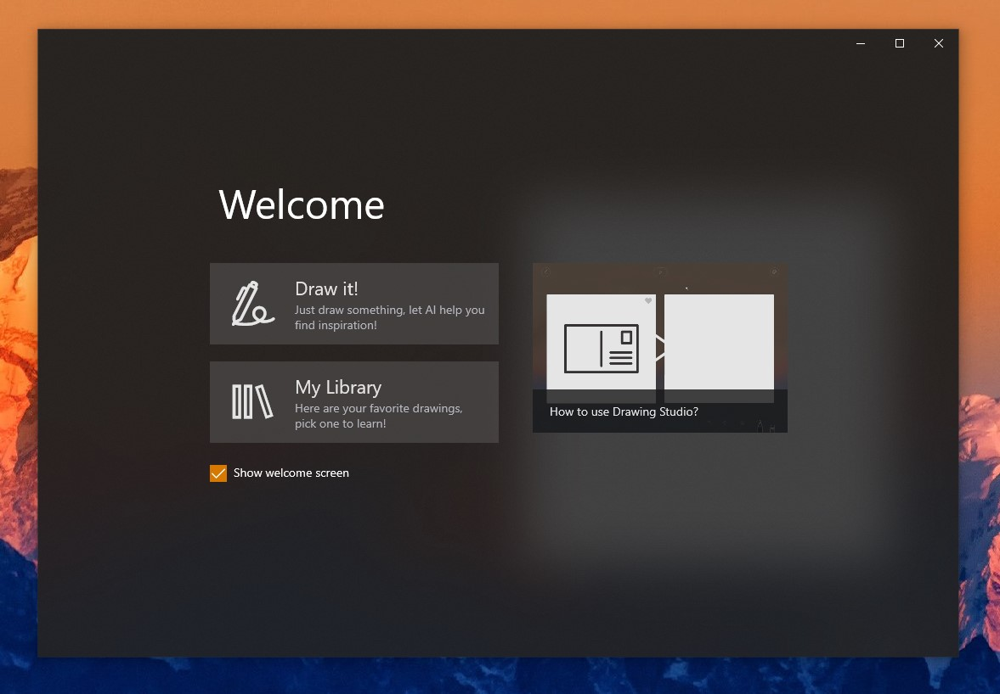
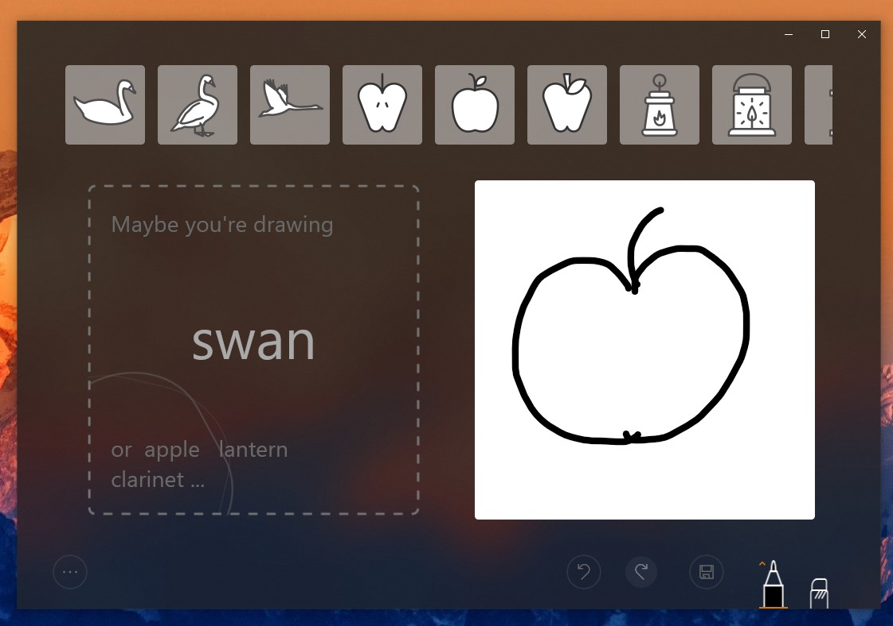
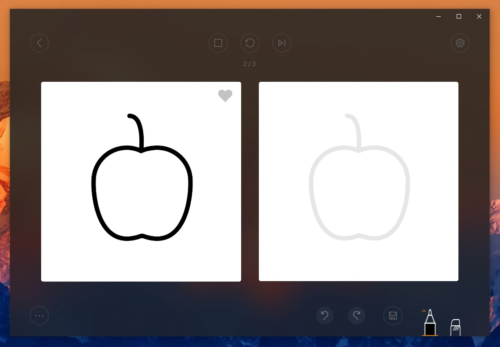
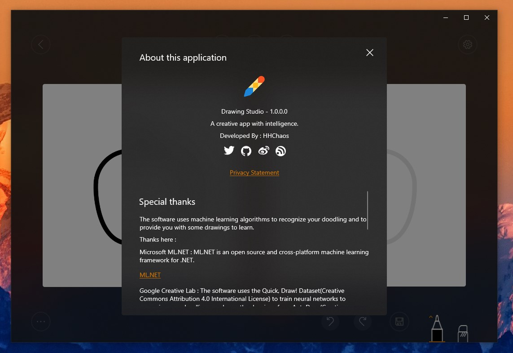

# Drawing Studio
---

A creative app with intelligence.

You can search in Windows Store or visit [this](https://www.microsoft.com/store/apps/9PKVX26RB8F0) to download Drawing Studio.

## Preview
---

Drawing Studio uses machine learning algorithms to recognize your doodling and to provide you with some drawings to learn.
Here are a few screenshots:

## License
---

The project is released under MIT License.

## Special Thanks
---

**Microsoft ML.NET ** :  [ML.NET](https://github.com/dotnet/machinelearning) is an open source and cross-platform machine learning framework for .NET.

**Google Creative Lab ** : The software uses the [Quick, Draw! Dataset](https://github.com/googlecreativelab/quickdraw-dataset)(Creative Commons Attribution 4.0 International License) to train neural networks to recognize your doodling，and uses the drawings from [AutoDraw](https://www.autodraw.com/)(Creative Commons Attribution 4.0 nternational License).

**Justin Liu** : [Justin](https://twitter.com/justinxinliu) is my friend. He is a great uwp developer and designer. His demo application has given me a lot of help with its great UI design and smooth animations!

## Contribution
---

Welcome feedback and contributions!

## Open Source Info
---

| Name                      | Site                                                         |
| ------------------------- | ------------------------------------------------------------ |
| HHChaosToolkit            | [HHChaosToolkit](https://github.com/HHChaos/HHChaosToolkit)  |
| SvgConverter              | [SvgConverter](https://github.com/HHChaos/SvgConverter)      |
| Unity                     | [Unity](https://github.com/unitycontainer/unity)             |
| Win2D                     | [Win2D](https://github.com/microsoft/Win2D)                  |
| Windows Community Toolkit | [Windows Community Toolkit](https://github.com/windows-toolkit/WindowsCommunityToolkit) |
| Windows Template Studio   | [Windows Template Studio](https://github.com/microsoft/WindowsTemplateStudio) |
| Windows UI Library        | [Windows UI Library](https://github.com/microsoft/microsoft-ui-xaml) |

